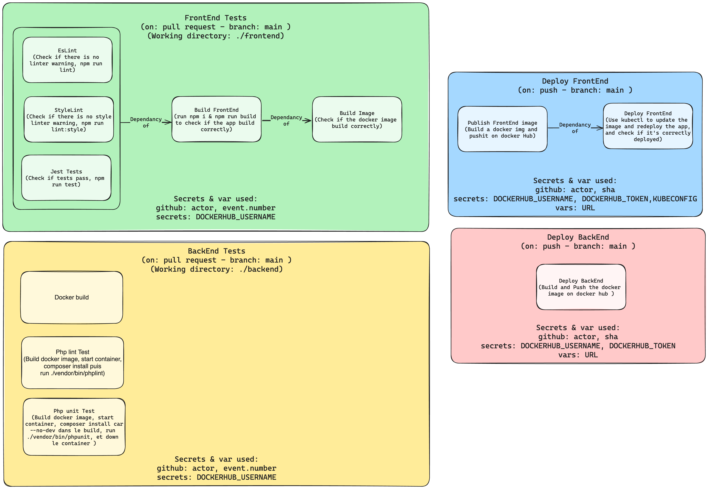

# Platiny

## Team
- Gatien ANIZAN ([mrpinkcat](https://github.com/mrpinkcat))
- Quentin PELTIER ([Timdev0](https://github.com/Timdev0))
- Samuel GUENIER ([sguenier](https://github.com/sguenier))
- Yohan CENTANNI ([ycenta](https://github.com/ycenta))
- Sébastien GAUDARD ([SebGrd](https://github.com/SebGrd))

## Main Features
- Reviews, type of reviews and notation systems (Quentin PELTIER)
- Reservation and schedule system (Yohan CENTANNI)
- Images Upload (Samuel GUENIER)
- Homepage (Gatien ANIZAN)
- Searchbar (Gatie ANIZAN & Yohan CENTANNI)
- Search result page (Gatien ANIZAN & Samuel GUENIER) 
- Establishment page (Quentin PELTIER, Gatien Anizan, Yohan CENTANNI)
- Postion Resolver for Map (Yoahn CENTANNI)
- Back-Office CRUDs (Everyone)
- Dashboard, Stats (back-office) (Sébastien GAUDARD)
- Mailing System (Sébastien GAUDARD)
- Front-Library (Everyone)
- Fixtures (Sébastien GAUDARD)
- DB structure and Schema (Gatien ANIZAN & Samuel GUENIER)
- Figma (Sébastien GAUDARD)

## CI/CD Schema

## Recomended plugins

When you go to the extensions tab in VSCode, you will see (at the bootom left of your screen) a list of recommended extensions for this project. You can install them for a better development experience.

| Extension | Description |
| --- | --- |
| [PHP Debug](https://marketplace.visualstudio.com/items?itemName=xdebug.php-debug) | Debug support for PHP with XDebug. Preconfigurated with the launch.json |
| [ESLint](https://marketplace.visualstudio.com/items?itemName=dbaeumer.vscode-eslint) | Integrates ESLint into VS Code. |
| [Symfony VSCode](https://marketplace.visualstudio.com/items?itemName=thenouillet.symfony-vscode) | Symfony integration for VS Code. |
| [CSS Var](https://marketplace.visualstudio.com/items?itemName=phoenisx.cssvar) | CSS variables autocomplete. Preconfigurated with the settings.json |
| [Code Owner](https://marketplace.visualstudio.com/items?itemName=jasonnutter.vscode-codeowners) | Used to display the code owner of a file. |
